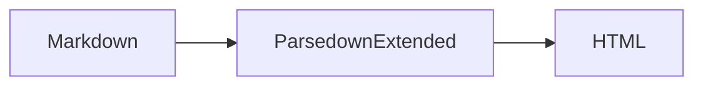

# Parsedown Extended feature showcase

[TOC]

This benchmark document exercises the Markdown elements added or enhanced by
ParsedownExtended. It is intentionally written like a README so that the
benchmark represents a realistic mix of prose and extension syntax.

## Text formatting {#text-formatting}

Alongside **bold** and *italic* text, ParsedownExtended supports ~~deleted~~,
++inserted++, ==marked==, H~2~O, x^2^, and [[Ctrl]] + [[Enter]] text.

Emoji shortcodes such as :rocket:, :sparkles:, and :white_check_mark: can be
used in prose. Typographer replacements include (c), (r), (tm), and ....
Smartypants can turn "quoted text", 'single quotes', --, ---, and ... into
typographic punctuation when enabled.

## Tasks and alerts

- [x] Install the package
- [x] Enable the required extensions
- [ ] Render the final document

> [!NOTE]
> Alerts can contain **formatted text** and `inline code`.

> [!TIP]
> Keep benchmark documents representative of real-world Markdown.

> [!IMPORTANT]
> Feature-specific syntax should be included in performance measurements.

> [!WARNING]
> Optional features may need to be enabled before they affect the output.

> [!CAUTION]
> Generated HTML should be sanitized when the Markdown is untrusted.

## Definitions and abbreviations

Markdown
: A lightweight markup language.

Parser
: Software that turns source text into another representation.

*[HTML]: HyperText Markup Language
*[AST]: Abstract Syntax Tree

ParsedownExtended converts Markdown into HTML without first building an AST.

## Tables and spans

| Feature | Syntax | Available |
| :--- | :---: | ---: |
| Tasks | `[x]` | Yes |
| Alerts | `[!NOTE]` | Yes |
| Table spans | `^` and `>` | Yes |
| ^ | These cells span columns | > |

## Links, references, and footnotes

Visit the [project website](https://example.com/parsedown-extended), send a
message to <maintainer@example.com>, or read the [configuration guide][docs].


References keep long destinations out of prose.[^references] Footnotes can
also contain multiple lines and **other Markdown elements**.[^details]

[docs]: https://example.com/parsedown-extended/docs "Documentation"
[^references]: Reference-style links improve readability in large documents.
[^details]: This is the first line of the longer footnote.
    This continuation belongs to the same footnote.

## Math and diagrams

Inline math can describe an equation such as $E = mc^2$.

$$
x = {-b \pm \sqrt{b^2 - 4ac} \over 2a}
$$



```chart
{"type":"bar","data":{"labels":["Extra","Extended"],"datasets":[]}}
```

## Code, quotes, and markup

Use `composer require benjaminhoegh/parsedown-extended` to install the parser.

```php
use BenjaminHoegh\ParsedownExtended\ParsedownExtended;

$parser = new ParsedownExtended();
echo $parser->text('Hello ==extended Markdown==!');
```

> Block quotes remain available alongside the extended alert syntax.

<!-- ParsedownExtended can preserve Markdown comments. -->

<aside>Raw block HTML can be enabled through configuration.</aside>

Inline <span>HTML markup</span> is supported when raw HTML is allowed.

---

The thematic break above marks the end of the feature showcase.
